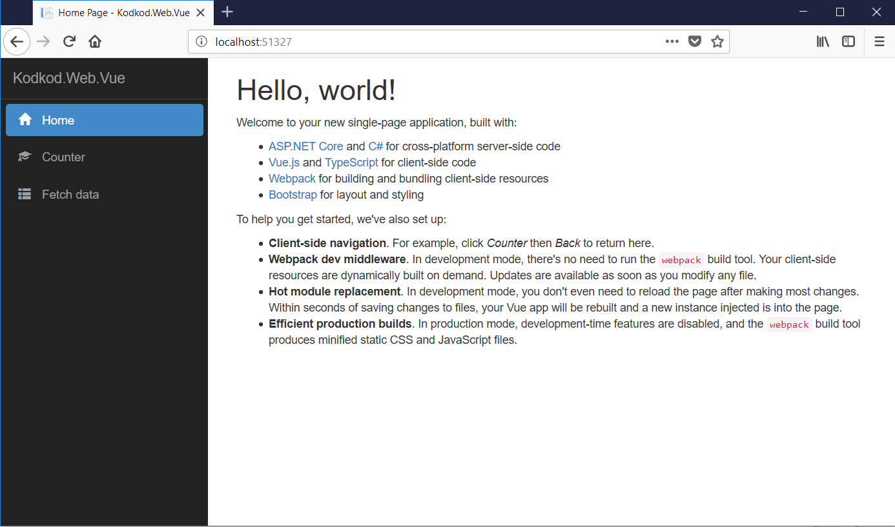
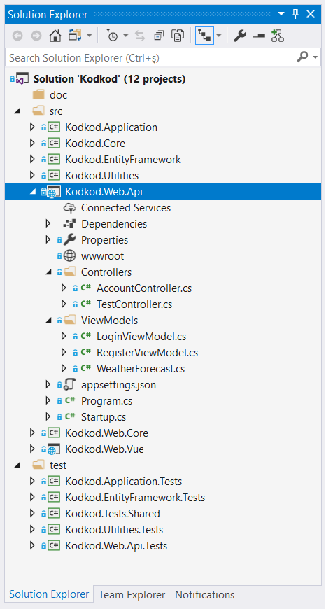
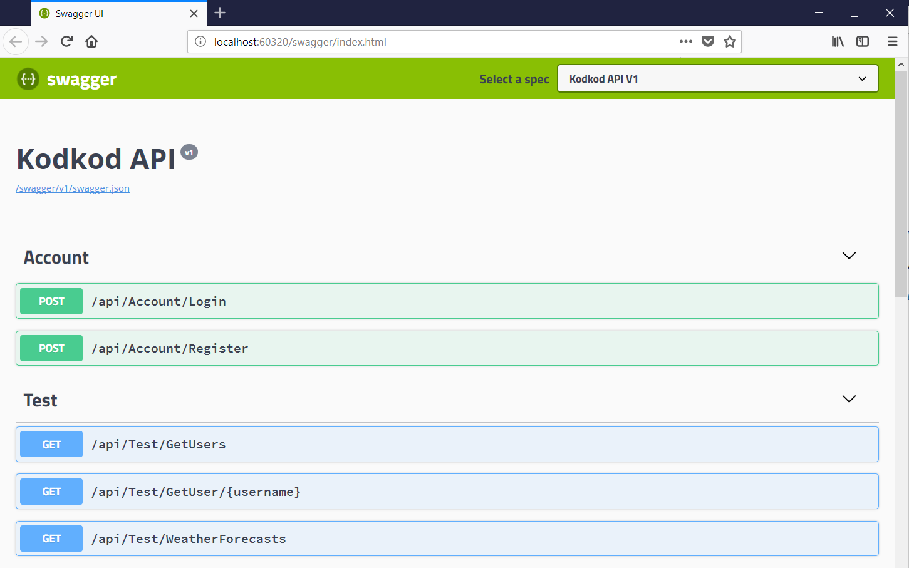

# Kodkod
Web API startup template with a Vue Client demo.

## How to Start?

- Select `Kodkod.Web.Api` project "**Set as Startup Project**" 
- Open "**Package Manager Console**" and select default project as "**src/Kodkod.EntityFramework**"
- Run `update-database` command to create database.
- Run(F5 or CTRL+F5) Web API project first and then run Vue Client or select multiple startup projects and select both and run(F5 or CTRL+F5).

## Vue Client Demo

## ASP.NET Core Web API 

### Project solution:

### Swagger UI

### Tags & Technologies

- ASP.NET Core Web API
- Entity Framework Core
- ASP.NET Core Identity
- JWT (Bearer Token) Based Authentication
- Automapper
- Serilog
- Swashbuckle
- xUnit
- ASP.NET Core Test Host
- In-memory Entity Framework Core
- Authorization & Authentication
- Exception Handling & Logging
- Vue
- Vue Router
- Bootstrap
- Microsoft.CodeCoverage
